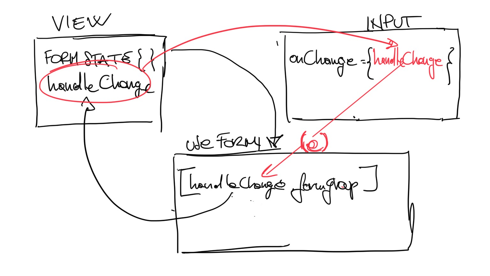

# Custom Hook (with reactive form)


## Getting started

1. Define the form's schema:

	```
	const formSchema = {
	    title: "",
	    numberInStock: "",
	    dailyRentalRate: "",
	    liked: "",
	    genre: {
	        label: "",
	        id: "",
	        value: "",
	    },
	```


2. This is a *reactive* form so it will be built a run time based on the response returned from the api:

- `const [controllers, setControllers] = useState([]);`
- fetch form from api:

	```
	async function getFormCtrls() {
	    const promise = httpService.get(`${config.portAPI}/movies-form`);
	    const response = await promise;
	    const formControllers = response.data
	    setControllers(formControllers);
	}
	```

- invoke method:

	```
	useEffect(() => {
	    console.clear();
	    getFormCtrls();
	    getMovies();
	}, []);
	```
	

- `formControllers` will look something like this:

	```
	[
	    {
	    "type": "text",
	    "name": "title",
	    "label": "Title",
	    "validators": [
	        "required|alpha"
	    ],
	    "options": [],
	    "id": "63adfb7c96e836ec0258c12e",
	    "index": 1
		}
	]
	```
	
	Hence we can looping trough it:
	
	```
	<form className="px-4" onSubmit={handleSubmit}>
	        <div className="form-group">
	            {controllers.map((ctrl) => (
	                <Fragment key={ctrl.id}>
	                	// do some stuff here...
	                </Fragment>
	            ))}
	        </div>
	    </form>
	```


## Custom hook


1. touch `useReactiveForm.jsx`
2. Let's define our hook:


	```
	function useFormControl(schema) {
	    const [formGroup, setStateFormGroup] = useState(schema);
	    return [formGroup];
	
	}
	```
	
3. Let's start simple: our hook will take one arg `schema`:

	```
	const formSchema = {
	    title: "",
	    numberInStock: "",
	    dailyRentalRate: "",
	    liked: "",
	    genre: {
	        label: "",
	        id: "",
	        value: "",
	    },
	```

	> Wait! How can we pass the schema to our custom hook?
	> Back to parent component we can invoke our custom hook:
	> `const [formGroup, handleChange] = reactiveForm.useFormControl(formSchema);`
	> Left side is what is returned from the hook and the right side is where we pass data `formSchema` to the hook 

4. Our form hook should handle the logic to **hookup the controllers with the UI**:


	```
	function useFormControl(schema) {
	    const [formGroup, setStateFormGroup] = useState(schema);
	    
	     const handleChange = (e) => {};
	     
	     return [formGroup, handleChange];
	
	}
	```

	> Wait a minute! Where da hell `e` is coming from?
	
	The `InputGroup` component (which is wrapped inside a fn `renderInput()` inside our hook) takes `handleChange` as prop:
	
	```
	function renderInput(
		handleChange,
		handleBlur,
		formGroup,
		) {
	const { label, name, type } = controller;
	return (
	    <InputGroup
	        label={label}
	        name={name}
	        value={formGroup[name]}
	        onChange={handleChange}
	        onBlur={handleBlur}
	        type={type}
	      
	    />
		);
	}	
	```
	
	
	and guess what? it's the same `const handleChange = (e) => {};` that we have just created! So the `e` is coming from the `InputGroup`.
	
	**Let's take a look at this graph:**
	
	
	
	
	
	So now we can hookup our controller with the ui just like that:
	
	```
	    const handleChange = (e) => {
        const clone = { ...formGroup };
        const current = e.target;

        clone[current.name] = current.value;


        setStateFormGroup(clone);
    };
	```


	> Ok. That's pretty awesome how this data will be used inside the parent component?	
	

5. Back to the parent component it's time to replace "do some stuff":

	```
	const [formGroup, handleChange] = reactiveForm.useFormControl(formSchema)
	
	
	<form onSubmit={handleSubmit}>
	        <div className="form-group">
	            {controllers.map((ctrl) => (
	                <Fragment key={ctrl.id}>
	                	reactiveForm.renderInput(
	                      ctrl,
	                      handleChange,
	                      formGroup,
	                  )
	                </Fragment>
	            ))}
	        </div>
	    </form>
	```


